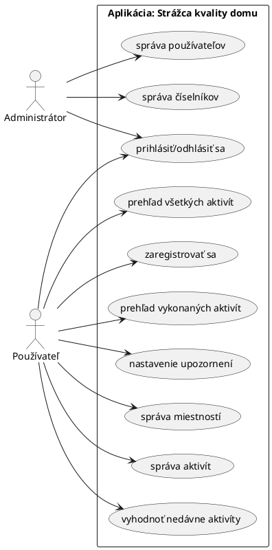
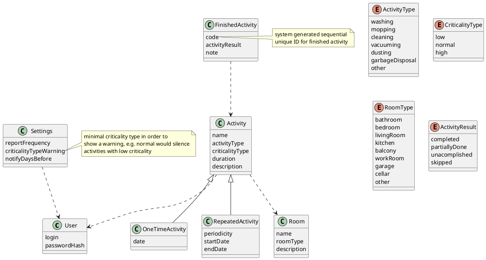

---
title: "Špecifikácia: Strážca kvality domu, verzia 1.1"
author: [Anton Kica]
date: "14.3.2025"
keywords: [špecifikácia]
...

# Špecifikácia: Strážca kvality domu, verzia 1.1

## História zmien

| verzia | dátum | zmena | autor |
| ------ | ----- | ----- | ----- |
| 1.0 | 9.3.2025 | vytvorená hrubá verzia špecifikácie | Anton Kica |
| 1.1 | 14.3.2025 | zapracovanie pripomienok; pridanie histórie obsahu a výkladu milníkov; úprava rolí, UC-diagramu, ER-diagramu, zmena HTMX na Svelte, časového harmonogramu | Anton Kica |

## O aplikácií

Cieľom tejto webovej aplikácie je poskytnúť jednoduchý nástroj na udržiavanie kvality a čistoty obytného priestoru.
Cieľovou skupinou sú obyvatelia domov, bytov alebo nájomníci, ktorí si chcú udržať prehľad a rutinu vo svojich obytných
priestoroch. Webová aplikácia poskytne používateľovi modul s aktivitami, kde si bude môcť zaznamenávať napríklad
plánované upratovania, čistenia, prania alebo jednorázové povinnosti podľa potreby.

## Funkčné požiadavky

### Roly

Aplikácia bude realizovaná pre jedného používateľa (_single-user_) bez zdieľania zdrojov.

#### Administrátor

Spravuje používateľov (blokuje alebo vymazáva) a aplikačné číselníky (upravuje obsah).

#### Užívateľ

Pri prvom vstupe do systému sa používateľ zaregistruje (zvolí si login a heslo| a vytvorí si účet,
pomocou ktorého sa autentifikuje pre účely používania aplikácie. Autentifikovaný používateľ ďalej vie interagovať so
systémom, vytvárať, spravovať, vymazávať alebo prezerať si svoje aktivity.

### Use case diagram

## Dátový model

### Entity a atribúty

| názov entity | popis |
| - | - |
| user | použivateľské konto potrebné na autentifikáciu voči systému |
| activity | abstraktná aktivita |
| repeated activity | implementuje pravidelnú aktivitu |
| one time activity | implementuje jednorázovú aktivitu |
| finished activity | záznam o už vykonanej aktivite |
| room | miesnosť, v ktorej sa vykonáva aktivita |
| settings | singleton, ktorým si používateľ konfiguruje nastavenia oznamov, hlásení a upozornení |

## Architektúra

Architektúra aplikácie bude realizovaná _client-server_ architektúrou ako SPA (_single page application_).

## Technologie

- __klient__: HTML5, CSS3, Bootstrap 5.3, JavaScript ES8, Svelte 5.23
- __server__: Rust 1.85, Actix 4
- __databáza__: MySQL 8.3
- __rozhranie client-server__: RestAPI
- __hosting__: <http://chodiacidotaznik.xyz>
- __podporované prehliadače__: Google Chrome 134, Firefox 136

## Časový harmonogram

| týždeň | od | do | funkcionalita |
| ------ | -- | -- | ------------- |
| 4 | 10.03 | 16.03 | oprava špecifikácie a príprava vývojového prostredia |
| 5 | 17.03 | 23.03 | implementácia kostry užívateľského rozhrania |
| 6 | 24.03 | 30.03 | implementácia CRUD pre entity aktivít na backend-e |
| 7 | 31.03 | 06.04 | implementácia administrátorského rozhrania a autentifikácie používateľov|
| 8 | 07.04 | 13.04 | konfigurácia a príprava produkčného prostredia |
| 9 (beta verzia) | 14.04 | 20.04 | implementácia nastavení, hlásení a upozornení |
| 10 | 21.04 | 27.04 | implementácia plnohodnotného užívateľského rozhrania |
| 11 (finálna verzia)| 28.04 | 04.05 | implementácia drobných features, ladenie a testovanie funkčnosti |

### Milníky

#### beta verzia

Beta verzia bude obsahovať jednoduché funkčné administrátorské a užívateľské rozhranie, v ktorom
si bude môcť užívateľ pridávať a upravovať svoje aktivity v systéme.

#### finálna verzia

Finálna verzia bude úhľadnejšia a viac uprataná s pridanými QOL (quality of life) fukncionalitami.