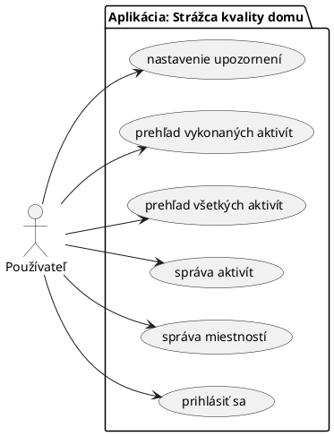
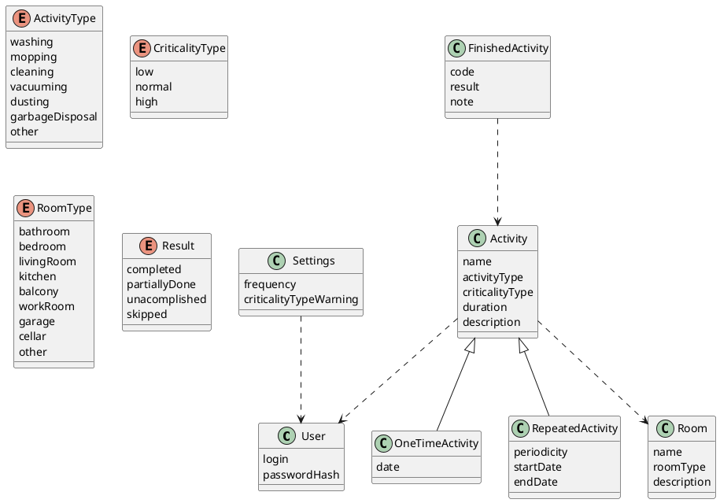

---
title: "Špecifikácia: Strážca kvality domu"
author: [Anton Kica]
date: "2025-03-25"
keywords: [Markdown, špecifikácia]
...

# Špecifikácia: Strážca kvality domu 

Cieľom tejto webovej aplikácie je poskytnúť jednoduchý nástroj na udržiavanie kvality a čistoty obytného priestoru.
Cieľovou skupinou sú obyvatelia domov, bytov alebo nájomníci, ktorí si chcú udržať prehľad a rutinu vo svojich obytných
priestoroch. Webová aplikácia poskytne používateľovi modul s aktivitami, kde si bude môcť zaznamenávať napríklad
plánované upratovania, čistenia, prania alebo jednorázové povinnosti podľa potreby.

## Funkčné požiadavky

### Roly

Aplikácia bude realizovaná pre jedného používateľa - `single-user` bez zdieľania zdrojov. Pri prvom vstupe do systému si užívateľ zvolí login a heslo,
pomocou ktorého sa autentifikuje pre účely používania aplikácie. Autentifikovaný používateľ ďalej vie interagovať so systémom, vytvárať, spravovať,
vymazávať alebo prezerať si svoje aktivity.

V aplikácií nie je prítomný žiadny administrátor alebo iný dodatočný správca systému a používateľov.

### Use case diagram

## Dátový model

### Entity a atribúty

| názov entity | popis |
| - | - |
| užívateľ | použivateľské konto potrebné na autentifikáciu voči systému |
| aktivita | abstraktná aktivita |
| pravidelná aktivita | implementuje pravidelnú aktivitu |
| jednorázová aktivita | implementuje jednorázovú aktivitu |
| vykonaná aktivita | záznam o už vykonanej aktivite |
| miestnosť | miesnosť, v ktorej sa vykonáva aktivita |
| nastavenia | singleton, ktorým si používateľ konfiguruje nastavenia oznamov, hlásení a upozornení |

## Architektúra

Architektúra aplikácie bude realizovaná ako client-server tradičnou formou pomocou niekoľkých stránok HTML.

## Technologie

- __klient__: HTML5, CSS, JavaScript, HTMX
- __server__: Rust, Actix
- __databáza__: MySQL 8.3, CSS, JavaScript
- __rozhranie client-server__: RestAPI
- __hosting__: <http://chodiacidotaznik.xyz>
- __podporované prehliadače__: Firefox (verzia 136.0)

## Časový harmonogram

| týždeň | od | do | funkcionalita |
| ------ | -- | -- | ------------- |
| 4 | 17.03 | 23.03 | oprava špecifikácie |
| 5 | 24.03 | 30.03 | príprava vývojového prostredia |
| 6 | 31.03 | 06.04 | implementácia kostry užívateľského rozhrania |
| 7 | 07.04 | 13.04 | implementácia CRUD pre entity na backende |
| 8 | 14.04 | 20.04 | konfigurácia a príprava produkčného prostredia |
| 9 (beta verzia) | 21.04 | 27.04 | implementácia hlásení a upozornení |
| 10 | 28.04 | 04.05 | implementácia plnohodnotného užívateľského rozhrania |
| 11 (finálna verzia)| 05.05 | 11.05 | doimplementovanie drobných feature a testovanie funkčnosti |